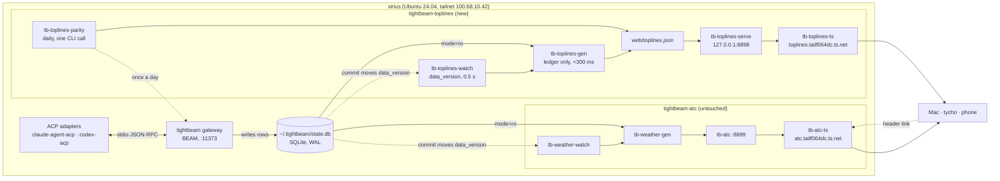

<!-- version: v2 | date: 2026-09-02 -->
<!-- changelog:
  - v2: Applied George's rulings of 2026-09-02: own hostname and sidecar
        (toplines.tailf064dc.ts.net) instead of a path on ATC's tunnel;
        recompute holders, kind and stage from the ledger rather than reading
        ATC's data.json; read-only v1; deploy as gd with user units; header
        link to ATC. Corrected the transaction guidance to match ATC's
        one-short-BEGIN-per-pass pattern.
  - v1: Initial note (2026-09-01), published as a Claude artifact during
        the design conversation.
-->

# TopLines architecture

## In one paragraph

TopLines is a static page plus a small generator, both on the Tightbeam host.
A watcher notices ledger commits through SQLite's `data_version` counter; a
generator reads the ledger read-only and writes one JSON file; the page fetches
that file. The gateway is never in the read path. The design is the one ATC's
snapshot pipeline already runs on the same box, with a faster cadence and a
tabular projection.

## System context



The two pipelines share the ledger file, the host, and the tailnet. They share
no process, port, file, container, or repo.

## Change-to-screen path

```mermaid
sequenceDiagram
  autonumber
  participant A as codex-acp (a PO)
  participant G as gateway
  participant D as state.db
  participant W as tb-toplines-watch
  participant B as tb-toplines-gen
  participant P as page
  A->>G: attest progress on a card
  G->>D: INSERT attests … COMMIT
  Note over D,W: data_version increments
  W->>W: next pulse (≤ 0.5 s) sees the change
  W->>B: run (cooldown ≤ 2 s since last pass ended)
  B->>D: BEGIN; read items, assignments, attests, turns, wakes, sessions, roles, decision_requests; COMMIT
  B-->>P: toplines.json rewritten (tmp + rename)
  P->>P: next single-flight fetch (≤ 2 s) sees new generatedAt
  Note over P: row updates in place: quiet resets, attest bar grows
```

| Stage | Budget |
|---|---|
| Notice the commit | ≤ 0.5 s |
| Cooldown since last pass ended | ≤ 2 s |
| Generate | < 0.3 s |
| Page fetch interval | ≤ 2 s |
| **Commit to screen** | **1 to 5 s** |

## Components

| Component | Runs as | Notes |
|---|---|---|
| `tb-toplines-watch` | systemd user unit `tb-toplines-watch.service` | Port of ATC's watcher. One `mode=ro` connection, `PRAGMA data_version` every 0.5 s, 2 s cooldown from pass end, 30 s heartbeat. Emits "change" and "beat"; a shell loop runs the generator. |
| `tb-toplines-gen` | child of the watcher | Python 3.12 stdlib. One `BEGIN` for a consistent snapshot, queries, `COMMIT`, close. Writes `toplines.json` to a temp file and renames. Exits non-zero and leaves the old file if a table or column it needs is missing. Merges the parity sidecar file if present. |
| `tb-toplines-serve` | systemd user unit `tb-toplines.service` | Stdlib static server on 127.0.0.1:8898, `no-store` on the JSON. |
| `web/index.html` | static | One file. Fetches `toplines.json` every 2 s, single flight (a new request starts only after the previous one completes), rows keyed by id. Stale banner past 90 s. Appearance toggle. Link to ATC. |
| `tb-toplines-ts` | docker container | `tailscale/tailscale`, host network, `TS_USERSPACE=1`, `TS_HOSTNAME=toplines`, named state volume. `tailscale serve --bg https+insecure://127.0.0.1:8898` or the plain-HTTP equivalent, tailnet-only. |
| `tb-toplines-parity` | systemd user timer, daily | One `tightbeam toplines --as-user george`. Compares quiet, cards and attest totals per open item to the latest `toplines.json`; compares stage per item to ATC's `data.json` read from disk. Writes `parity.json` beside the output for the generator to merge. |

## Why the ledger and not the gateway

The gateway exposes HTTP reads behind device tokens (`/api/work`,
`/api/work-items`, `/api/session-status`) that return work-state lists, not the
toplines projection. Its `toplines` verb is reachable only through the CLI
dispatch path, which records every call. It also pushes `work_state` doorbells
over its WebSocket, and its own code describes those as a hint to re-read, never
truth. The ledger is the source both the gateway and ATC agree on; SQLite's WAL
mode allows any number of readers beside the one writer with no lock contention;
`mode=ro` makes a write impossible by construction. The cost is operator-scope
visibility, which is the correct behavior for a one-operator org (D8).

## Why `data_version` and not the doorbells

The doorbells cover assignment and item changes for subscribed owners. They do
not cover wakes firing, turns starting, or sessions spawning, all of which the
board shows. `data_version` covers every commit, costs microseconds, needs no
paired device credential, and is what ATC already trusts.

## Why recompute holders, kind and stage instead of reading ATC's `data.json`

ATC's file is on the same host and already carries agents with kind and items
with holders and stage. Reading it would save about sixty lines. It would also
make the board depend on an undocumented JSON shape and on ATC's ten-second
cadence, and break the board when ATC changes. The board ports the two
derivations under MIT with attribution, and the daily parity check compares
stage per item against ATC's file so the two views cannot silently disagree.

## Failure modes

| Failure | Effect | Handling |
|---|---|---|
| Generator crashes mid-pass | old `toplines.json` stays; page goes stale | non-zero exit is logged; watcher retries on next change or beat; stale banner after 90 s |
| Schema drift after a Tightbeam upgrade | generator exits non-zero | parity check and the stale banner both surface it; fix queries; nothing else is affected |
| Long read transaction | WAL grows | the generator's transaction spans one pass under 300 ms; the footprint block shows WAL bytes so growth is visible on the page |
| Watcher dies | page stale | `Restart=on-failure`; stale banner |
| Sidecar down | hostname unreachable | ATC unaffected; `docker restart tb-toplines-ts`; fallback `http://127.0.0.1:8898` over an ssh tunnel |
| Ledger grows 10x | pass time grows | queries are indexed by item and session; budget is 300 ms today; re-measure at each upgrade |

## Cost on the host

Measured for ATC over 16 hours on 2026-09-01: watcher plus generator about 6%
of one core, page server negligible, 5 MB and 16 MB resident. TopLines at a 2 s
cooldown is expected to be similar or lower since its pass has no git probes.
The host had load 0.03 on 16 threads and 21 GB free.

## What is deliberately not here

Push transport (SSE or WebSocket) to the page: the single-flight fetch survives
laptop sleep, phone backgrounding and the sidecar without reconnect logic, and
two seconds is within budget. Per-user scoping: one operator. A gateway-native
board: the right long-term home, but upstream is not ours and the ledger pattern
is proven on this box. Actions from the page: D4.
